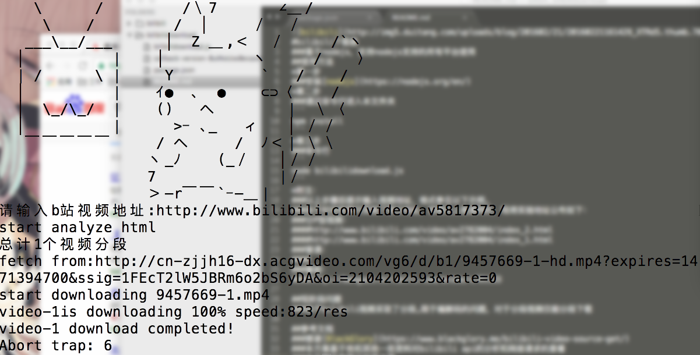

#bilibili下载器
###基于nodejs，支持nodejs支持的所有平台使用
##使用方法
*第一步
###安装[nodejs](https://nodejs.org/en/)
*第二步
###通过命令行进入本文件夹
```
npm install
```
*第三步
###命令行
```
node bilibilidownload.js
```
###all done，开始享受PC端的bilibili下载吧！
*附注：
###以上步骤后提示输入视频地址，格式参见以下示例。
###由于时间有限只实验了部分地址，但理论上是通用的，现将实验地址公布如下：
###分P型视频：
####http://www.bilibili.com/video/av2782004/index_2.html
####http://www.bilibili.com/video/av2782004/index_1.html
###普通：
####http://www.bilibili.com/video/av5817373/
###番剧：
####http://bangumi.bilibili.com/anime/v/91133
###示例图

##现阶段问题
###由于bilibili视频采取了分段,限于编解码的问题，对于分段视频仅能分段下载

##参考文档
###感谢[BlackGlory](https://www.blackglory.me/bilibili-video-source-get/)
###本方案基于他和其他一些资料对bilibili api的分析和网络请求的查看
###本方案仅作学习交流之用


